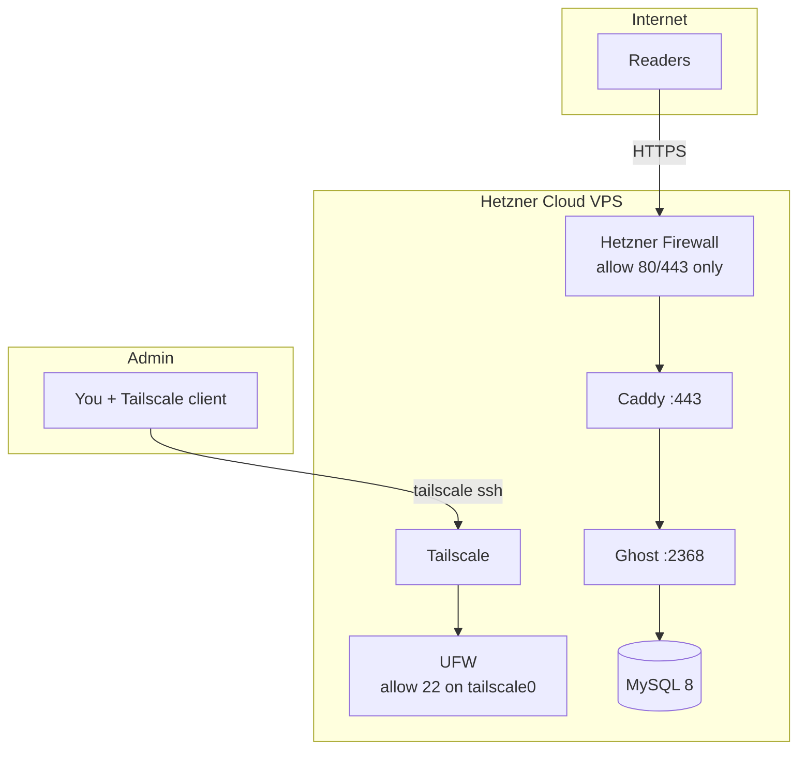

# Ghost Blog — One-Click Hetzner Deploy (Tailscale SSH)

Deploy a production [Ghost](https://ghost.org/) blog on [Hetzner Cloud](https://www.hetzner.com/cloud) with **no public SSH**. Admin access is via [Tailscale SSH](https://tailscale.com/kb/1193/tailscale-ssh); the blog is served over HTTPS through Caddy.

## Architecture



| Layer | Purpose |
|-------|---------|
| Hetzner Cloud Firewall | Blocks inbound SSH (and everything except 80/443) at the provider edge |
| UFW on host | Allows SSH only on `tailscale0`; allows 80/443 publicly |
| Tailscale | Private mesh; `tailscale ssh root@<server>` for administration |
| Caddy | Automatic HTTPS (Let's Encrypt) for Ghost |
| Ghost + MySQL | CMS and database |

## Prerequisites

On your **local machine** (macOS, Linux, or WSL):

1. [Hetzner Cloud](https://console.hetzner.cloud/) account + [API token](https://docs.hetzner.com/cloud/api/getting-started/using-api/)
2. [hcloud CLI](https://github.com/hetznercloud/cli#installation)
3. [Tailscale](https://tailscale.com/download) account + [auth key](https://login.tailscale.com/admin/settings/keys) (reusable, preauthorized)
4. A domain with DNS you control (A record → server IP after deploy)

## Quick Start

```bash
git clone <repository-url>
cd ghost-hetzner
cp .env.example .env
# Edit .env: HCLOUD_TOKEN, TAILSCALE_AUTH_KEY, GHOST_URL, passwords

chmod +x deploy.sh scripts/*.sh
./deploy.sh
```

After 3–5 minutes:

1. Point your domain DNS A record to the printed IPv4 address
2. Approve the node in [Tailscale admin](https://login.tailscale.com/admin/machines) if needed
3. SSH (Tailscale only):

   ```bash
   tailscale ssh root@<HCLOUD_SERVER_NAME>
   ```

4. Complete Ghost setup at `https://your-domain/ghost`

## Configuration (`.env`)

| Variable | Description |
|----------|-------------|
| `HCLOUD_TOKEN` | Hetzner API token |
| `HCLOUD_SERVER_NAME` | VPS name (used for Tailscale SSH hostname) |
| `TAILSCALE_AUTH_KEY` | Preauthorized Tailscale key |
| `GHOST_URL` | Public URL, e.g. `https://blog.example.com` |
| `MYSQL_ROOT_PASSWORD` | MySQL root password |
| `MYSQL_PASSWORD` | MySQL `ghost` user password |
| `ACME_EMAIL` | Optional; Let's Encrypt contact email |

Optional SMTP variables for Ghost mail — see `.env.example`.

## What `deploy.sh` Does

1. Creates (or reuses) a Hetzner firewall allowing **only** TCP 80 and 443
2. Creates an Ubuntu VPS with cloud-init user-data
3. On first boot: installs Docker, Tailscale, configures UFW, starts Ghost stack
4. Prints server IP and Tailscale SSH instructions

No manual SSH to a public IP is required or possible after provisioning.

## Operations

| Task | Command |
|------|---------|
| View deploy log | `tailscale ssh root@<server> -- tail -f /var/log/ghost-deploy.log` |
| Restart stack | `tailscale ssh root@<server> -- bash -lc 'cd /opt/ghost-blog && docker compose -f compose/docker-compose.yml --env-file .env restart'` |
| Update Ghost image | Same host, run `docker compose pull && docker compose up -d` in `/opt/ghost-blog` |

## Security Notes

- Public port 22 is **not** opened in the Hetzner firewall
- Host UFW only permits SSH on the Tailscale interface
- Store `.env` locally; it is written to `/etc/ghost-deploy.env` on the server during bootstrap only
- Rotate Tailscale auth keys after deploy if the key was single-use

## AI Conversations

Per assignment requirements, exports of AI-assisted development sessions are in [docs/ai-conversations/](docs/ai-conversations/).

## Related Docs

- [TASK.md](TASK.md) — assignment checklist
- [docs/adr/001-tailscale-ssh-only.md](docs/adr/001-tailscale-ssh-only.md) — why Tailscale for tunnel-only SSH
- [docs/adr/002-cloud-init-one-click.md](docs/adr/002-cloud-init-one-click.md) — why cloud-init for bootstrap without SSH
